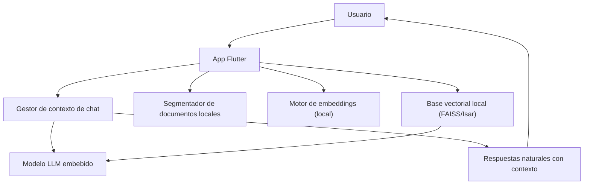

## Documento 2: Propuesta de Solución y Plan de Desarrollo

### Título:
**Solución móvil offline con IA local e indexación semántica embebida**

### Tecnologías clave:
- **Flutter** para la interfaz móvil (cross-platform).
- **SQLite / Isar** como base de datos local.
- **FAISS o tantivy (a través de FFI)** para búsqueda vectorial offline.
- **Modelo LLM embebido** como Phi-2, TinyLlama o Mistral cuantizado, usando:
  - [llama.cpp](https://github.com/ggerganov/llama.cpp)
  - [MLC-LLM](https://mlc.ai/)
- **ONNX / GGML** para ejecución eficiente en CPU.

### Arquitectura general:

### Funcionalidades esenciales:
1. **Inicio de chat**:
   - Reconstrucción del contexto previo.
2. **Carga de documentos**:
   - Procesamiento en chunks minuciosos.
   - Vectorización local.
   - Almacenamiento indexado.
3. **Consulta del usuario**:
   - Vectorización de la consulta.
   - Recuperación de documentos similares.
   - Uso del historial del chat como contexto.
   - Generación de respuesta con modelo local.
4. **Soporte offline total**:
   - Todo lo anterior sin conexión a internet.

### Fases del desarrollo:
**Fase 1: Infraestructura básica**
- Set up de Flutter, BD local, lectura de archivos PDF/Docx.
- Gestor de sesiones y chats.

**Fase 2: Búsqueda semántica local**
- Embeddings con modelo local.
- Integración con FAISS o alternativa embebida.

**Fase 3: Respuesta natural local**
- Integrar LLM pequeño embebido.
- Probar tiempos de respuesta y optimización.

**Fase 4: Conversaciones con contexto**
- Historial de mensajes.
- Memoria conversacional para mejorar respuestas.

**Fase 5: Sincronización online (opcional)**
- Si hay conexión, sincronizar nuevos documentos o conversaciones con servidor.

### Buenas prácticas a aplicar:
- Arquitectura **clean** en Flutter: `presentation`, `domain`, `data`.
- Uso de `Riverpod` o `Bloc` para manejo de estado.
- Separación clara de responsabilidades.
- Persistencia bien aislada.

