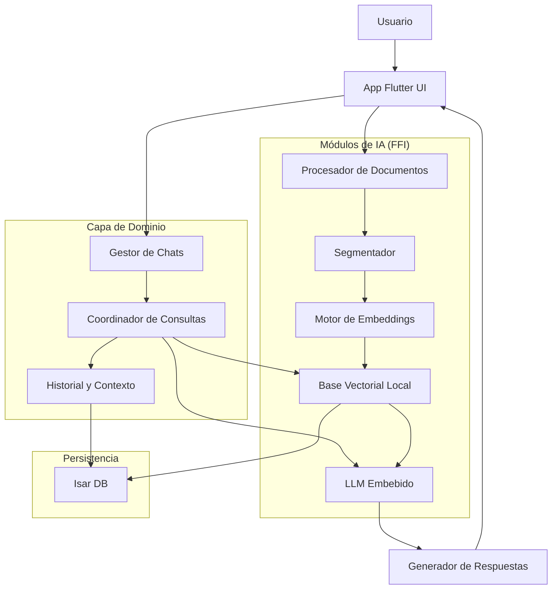

# Arquitectura para App Móvil Offline con IA Embebida

## 1. Visión General

Esta arquitectura propone una solución completa para una aplicación móvil que puede funcionar sin conexión a internet, manteniendo la capacidad de consultar documentos mediante búsqueda semántica y generación de respuestas con IA.

## 2. Componentes Principales

### 2.1 Capa de Presentación (Flutter UI)
- Interfaz de usuario para chat, carga de documentos y configuración
- Manejo de estado con Riverpod (más ligero y directo que Bloc)
- Diseño sencillo pero funcional, priorizando rendimiento

### 2.2 Capa de Dominio
- Gestión de chats y sesiones
- Generación de consultas y procesamiento de respuestas
- Coordinación entre componentes

### 2.3 Capa de Datos
- Persistencia local con Isar DB (alternativa moderna a SQLite, optimizada para Flutter)
- Almacenamiento de documentos procesados
- Almacenamiento de historial de conversaciones

### 2.4 Módulos de IA (Bridge a código nativo)
- **Procesador de Documentos**: Segmentación y tokenización local
- **Motor de Embeddings**: Modelo ligero para vectorización
- **Base Vectorial**: FAISS o alternativa embebida mediante FFI
- **LLM Local**: Phi-2, TinyLlama o Mistral cuantizado, optimizado para móvil

## 3. Diagrama de Arquitectura

## 4. Flujo de Funcionamiento

1. **Carga de documentos**:
   - El usuario sube documentos desde su dispositivo
   - Se procesan localmente, segmentándolos en chunks pequeños
   - Se generan embeddings para cada segmento
   - Se almacenan en la base vectorial local

2. **Consulta del usuario**:
   - El usuario envía un mensaje en el chat
   - Se vectoriza la consulta
   - Se recuperan fragmentos relevantes de la base vectorial
   - Se envían al LLM embebido junto con el contexto de la conversación
   - El LLM genera una respuesta natural
   - Se muestra al usuario y se guarda en el historial

## 5. Tecnologías Clave

| Componente | Tecnología | Razón |
|------------|------------|-------|
| Frontend | Flutter | Cross-platform, rendimiento nativo |
| Estado | Riverpod | Ligero, intuitivo, menos código que Bloc |
| Base de datos | Isar | Optimizada para Flutter, más rápida que SQLite |
| Vector search | FAISS (via FFI) | Eficiente para búsqueda de similitud |
| Embeddings | MiniLM o MobileBERT | Modelos ligeros optimizados para móvil |
| LLM | Phi-2/TinyLlama/Mistral (GGML) | Modelos cuantizados para dispositivos móviles |
| Bridge nativo | FFI | Para componentes de alto rendimiento |

## 6. Decisiones técnicas

- **Flutter FFI sobre código puro Dart**: Para operaciones intensivas como embeddings y LLM
- **Isar sobre SQLite**: Mayor rendimiento, API más moderna, mejor integración con Flutter
- **Riverpod sobre Bloc**: Menos código boilerplate, curva de aprendizaje más corta
- **Embeddings locales**: Priorizar modelos pequeños (~50MB) sobre precisión extrema
- **LLM cuantizado**: Usar modelos de 2-3B parámetros en formato GGML/GGUF para equilibrar calidad y rendimiento