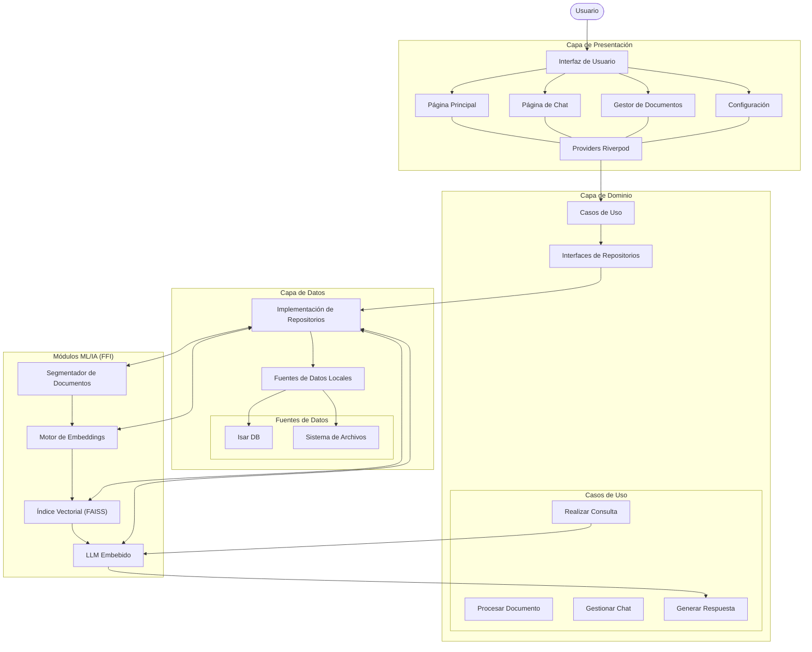
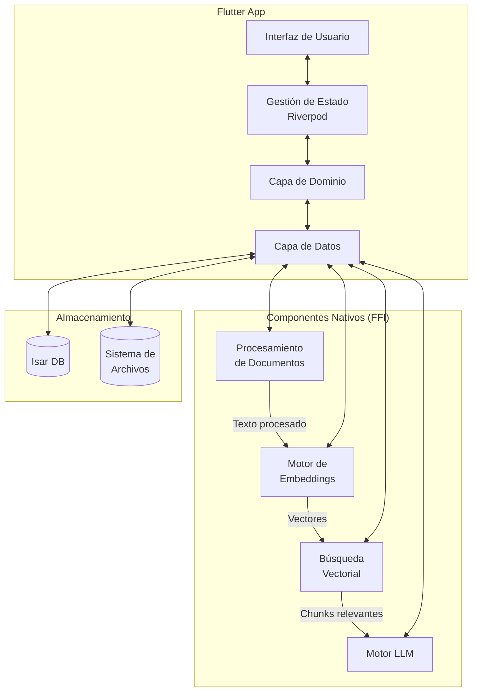
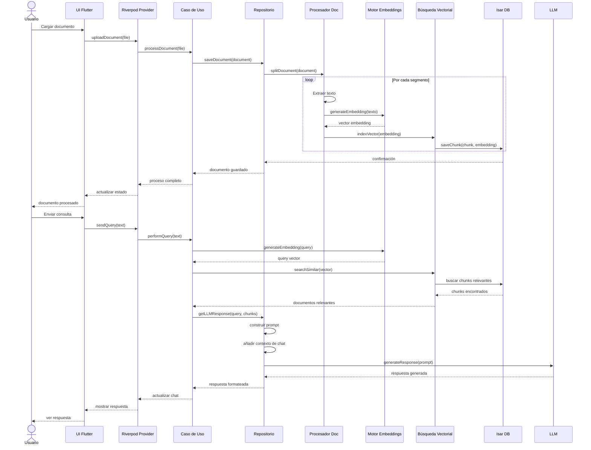
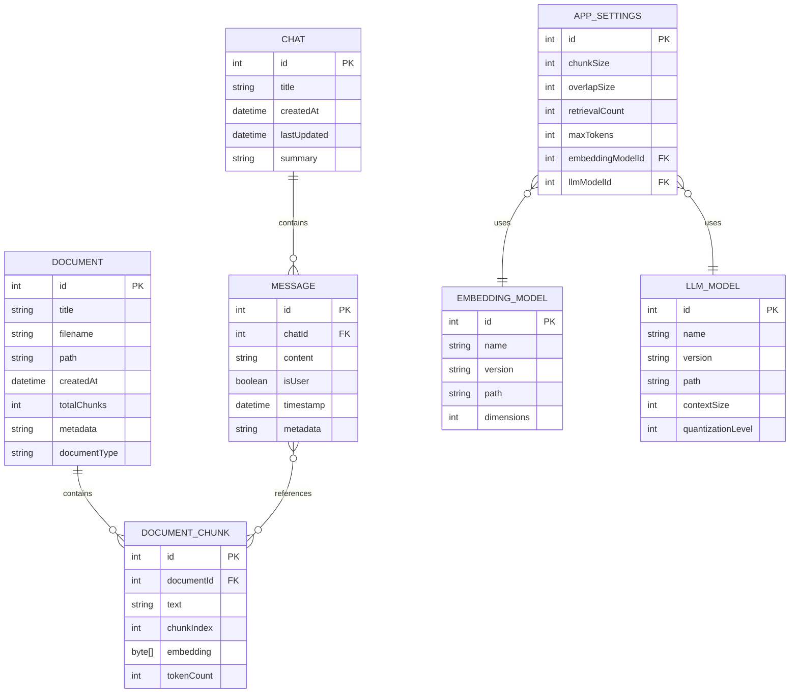
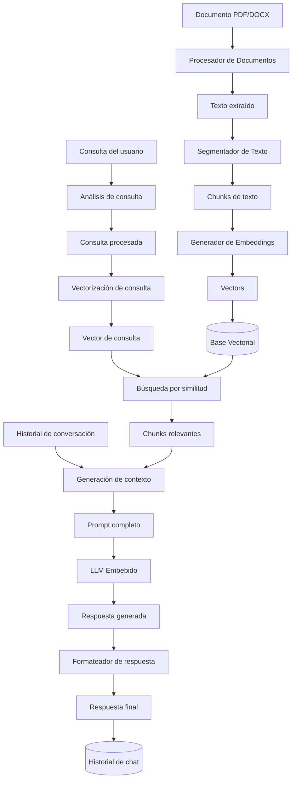
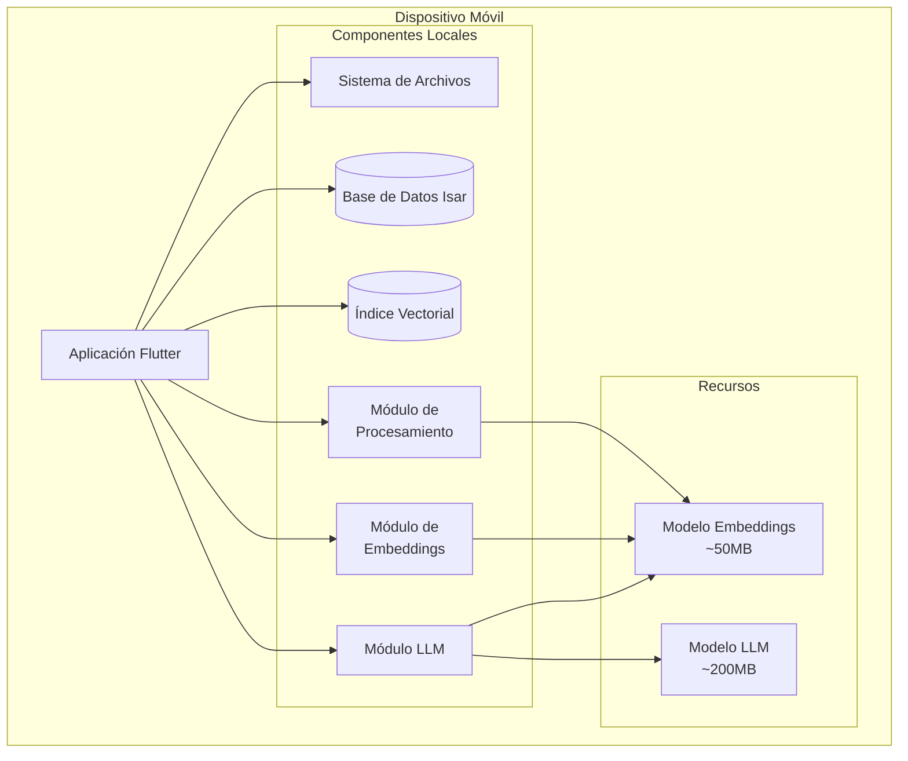
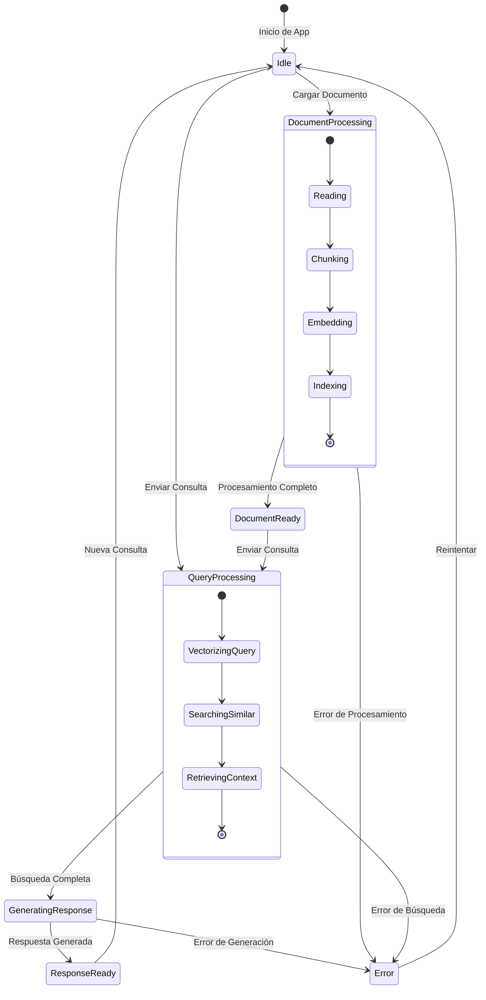

# Diagramas Detallados para la App Móvil con IA Offline

## 1. Diagrama de Arquitectura Detallado

## 2. Diagrama de Componentes

## 3. Diagrama de Secuencia: Procesar Documento y Consultar

## 4. Diagrama de Entidad-Relación

## 5. Diagrama de Flujo de Datos

## 6. Diagrama de Despliegue

## 7. Diagrama de Estados (Chat)

